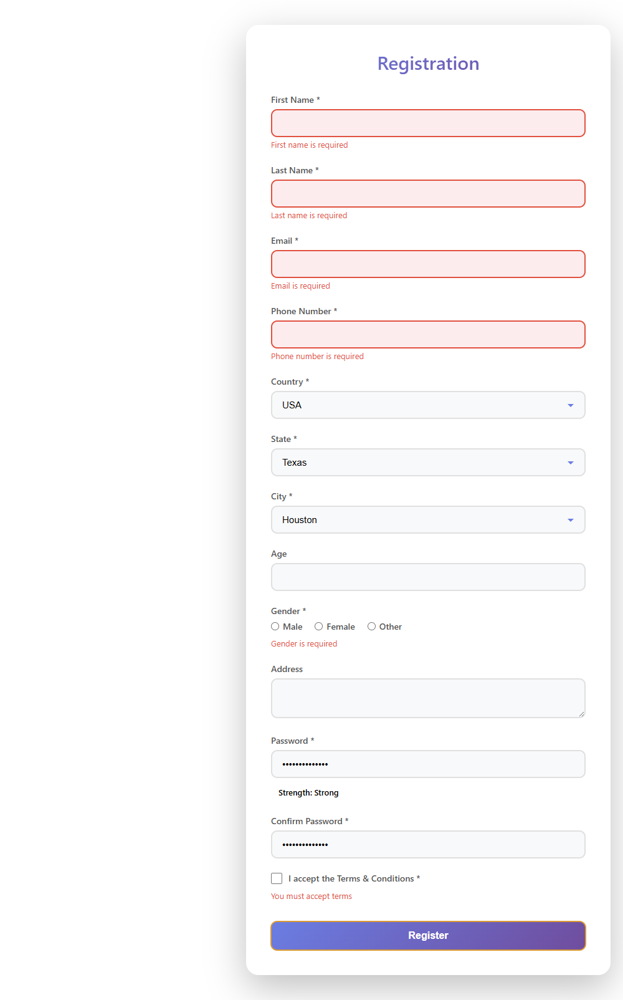

# Intelligent Registration System

Minimal MERN stack application with a registration form and Cypress automation.

## Folder Structure
```
registration-system/
├── backend/
│   ├── node_modules/
│   ├── package.json
│   └── server.js      # Express server (Port 5000)
├── frontend/
│   ├── cypress/       # Cypress tests and screenshots
│   ├── node_modules/
│   ├── src/
│   │   ├── components/
│   │   │   ├── RegistrationForm.jsx
│   │   │   └── RegistrationForm.css
│   │   ├── App.jsx
│   │   └── App.css
│   ├── package.json
│   └── vite.config.js # Vite dev server (Port 5173)
└── README.md
```

## Setup & Running

### 1. Backend
```bash
cd backend
npm install
npm start
```
*Server runs on http://localhost:5000*

### 2. Frontend
```bash
cd frontend
npm install
npm run dev
```
*Vite serves the app on http://localhost:5173*

### 3. Automation (Cypress)
Ensure both Backend and Frontend servers are running, then:
```bash
cd frontend
npx cypress run
```
## Screenshots

### Registration Form UI


### Validation Errors


### Cypress Test – Success


## Key Features
- **MERN Stack**: Minimal implementation (No DB, simulation only).
- **Validation**: Reactive validation for email, passwords, and required fields.
- **Security**: Blocks disposable email domains.
- **UI**: Responsive design using plain CSS.
- **Automation**: Cypress tests for Negative, Positive, and Logic flows.
